### Schema Provided
- Return Interfaces
  - status: true
  - msg: string
  - result: [...]
```json
{
   "status": true,
   "msg": "Đã thành công!"
   "result": [...]
}
```
nanoID https://www.npmjs.com/package/nanoid

## Class Diagram

```mermaid
---
config:
  theme: default
  layout: elk
  look: classic
---
classDiagram
    class Users {
        +_id: varchar(12) - PK
        +name: varchar(255) 
        +email: varchar(255) Unique
        +password: varchar(60)
        +avatar_id: varchar(12) FK
        +token?: varchar(255)
        +roles: enum('user', 'admin', 'moderator')
        +gender: enum('male', 'female', 'none')
        +is_verified: boolean
        +is_active: boolean
    }

    class Favorites {
        PK: user_id and content_id
        +user_id: varchar(12) - FK
        +content_id: varchar(12) - FK
        +favorited_at: timestamp
    }

    class History {
        PK: user_id and media_id
        user_id: varchar(12) - FK
        media_id: varchar(12) - FK
        watched_at: timestamp
        progress?: integer
    }

    class Imgs {
        +_id: varchar(12) - PK
        +imgur_id: varchar(255) Unique
        +delete_hash: varchar(255)
        +path: varchar(255)
        +type: enum('avatar', 'person', 'thumbnail', 'banner')
        +metadata: json
    }

    class Media {
        +_id: varchar(12) - PK
        +content_id: varchar(12) - FK
        +public_id: varchar(255) Unique
        +episode: integer
        +season: integer
        +title: varchar(255)
        +audio_type: enum('subtitle','original','voiceover')
    }

    class Contents {
        +_id: varchar(12) - PK
        +title: varchar(255)
        +origin_title: varchar(255)
        +english_title: varchar(255)
        +slug: varchar(255) Unique
        +overview: varchar(255)
        +imdb_rating: decimal(3,1)
        +lastest_episode?: integer
        +lastest_season?: integer
        +rating: decimal(2,1)
        +runtime?: integer
        +type: enum('movie','tvshow')
        +release_date: date
        +year: integer
        +publish: boolean
        +thumbnail_path?: varchar(255)
        +banner_path?: varchar(255)
        +status: enum('upcoming','finish','updating')
    }

    class Genres {
        +_id: varchar(12) - PK
        +name: varchar(100)
        +english_name: varchar(100) Unique
        +slug: varchar(100) Unique
    }

    class Countries {
        +_id: varchar(12) - PK
        +name: varchar(100)
        +slug: varchar(100) Unique
        +code: varchar(2) Unique
    }

    class Person {
        +_id: varchar(12) - PK
        +name: varchar(255)
        +slug: varchar(255) Unique
        +profile_path: varchar(255)
    }

    class Departments {
        +_id: varchar(12) - PK
        +name: varchar(100)
        +slug: varchar(100) Unique
    }

    class Collections {
        +_id: varchar(12) - PK
        +name: varchar(255)
        +slug: varchar(100)
        +description: varchar(255)
        +type: enum('topic','hot','features')
        +publish: boolean
        +create_at: timestamp
    }

    class Reviews {
        +_id: varchar(12) - PK
        +user_id: varchar(12) - FK
        +content_id: varchar(12) - FK
        +comment: varchar(255)
        +rating?: decimal(2,1)
        +review_at: timestamp
    }

    class ContentGenre{
        PK: content_id and genre_id
        +content_id: varchar(12) - FK
        +genre_id: varchar(12) - FK
    }

    class ContentCountry{
        PK: content_id and country_id
        +content_id: varchar(12) - FK
        +country_id: varchar(12) - FK
    }

    class CollectionContent{
        PK: collection_id and content_id
        +collection_id: varchar(12) - FK
        +content_id: varchar(12) - FK
        +rank: integer
        +added_at: timestamp
    }

    class PersonDepartment{
        PK: collection_id and content_id
        +person_id: varchar(12) - FK
        +department_id: varchar(12) - FK
    }
    class Directors{
        PK: person_id and content_id
        +person_id: varchar(12) - FK
        +content_id: varchar(12) - FK
        +rank: integer
    }

    class Casts{
        PK: person_id and content_id
        +person_id: varchar(12) - FK
        +content_id: varchar(12) - FK
        +character: varchar(255)
        +rank: integer 
    }

    Users --> Imgs: "avatar_id"

    History --> Users: "user_id"
    History --> Media: "media_id"

    Favorites --> Users: "user_id"
    Favorites --> Contents: "content_id"

    Media --> Contents: "content_id"

    Reviews --> Users: "user_id"
    Reviews --> Contents: "content_id"

    CollectionContent --> Collections: "collection_id"
    CollectionContent --> Contents: "content_id"

    ContentCountry --> Contents: "content_id"
    ContentCountry --> Countries: "country_id"

    ContentGenre --> Contents: "content_id"
    ContentGenre --> Genres: "genre_id"

    PersonDepartment --> Person: "person_id"
    PersonDepartment --> Departments: "departments_id"

    Directors --> Person: "person_id"
    Directors --> Contents: "content_id"

    Casts --> Person: "person_id"
    Casts --> Contents: "content_id"
```


## Entities Relationship Diagram
